 

## `// SECTORS`

<table>
<tr>
<td width="20%" valign="top">

**`SECTOR::AI-ML`**
Model design, training pipelines, applied ML systems.

</td>
<td width="20%" valign="top">

**`SECTOR::SEC`**
Offensive security, penetration testing, red-team tradecraft.

</td>
<td width="20%" valign="top">

**`SECTOR::OSINT`**
Recon, attribution, open-source intelligence gathering.

</td>
<td width="20%" valign="top">

**`SECTOR::BACKEND`**
APIs, services, data layers, system architecture.

</td>
<td width="20%" valign="top">

**`SECTOR::FRONTEND`**
Interfaces, motion, vanilla-first builds.

</td>
</tr>
</table>

## `// STACK`

**AI / ML**
 

**Security / OSINT**
 

**Backend**
 

**Frontend**
 

## `// TELEMETRY`

 

`SIGNAL :: OPEN` &nbsp;·&nbsp;
<a href="#">LinkedIn</a> &nbsp;·&nbsp;
<a href="#">Twitter/X</a> &nbsp;·&nbsp;
<a href="mailto:you@example.com">Email</a>

